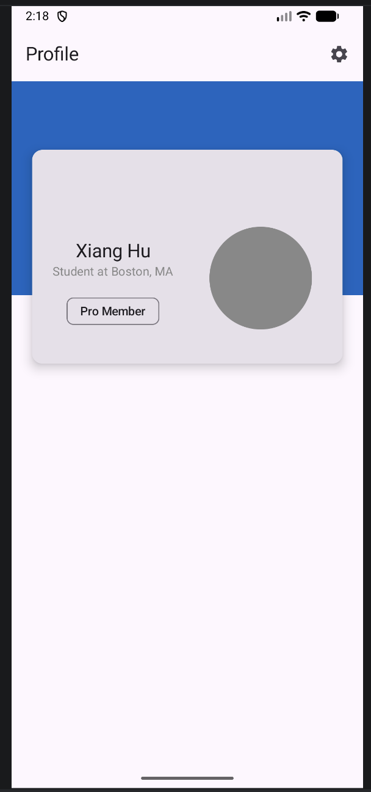

# IA3 – Q2 Profile Header

## Overview

This project builds a LinkedIn-style profile header using Jetpack Compose and Material 3. A `Box` is used to layer a background, a circular avatar, and an overlapping `Card` to create a classic profile layout.

## Implementation Notes

The layout demonstrates `align`, `offset`, fixed sizing, and `clip(CircleShape)` for the avatar. Elevation is applied through `CardDefaults.cardElevation` to create depth. Material 3 components include `TopAppBar`, `Card`, `IconButton`, `AssistChip`, and `FilledTonalButton`.

## AI Usage Notes

ChatGPT was used to clarify terms like layering and positioning concepts and to assist with debugging layout alignment.

## Screenshot:

